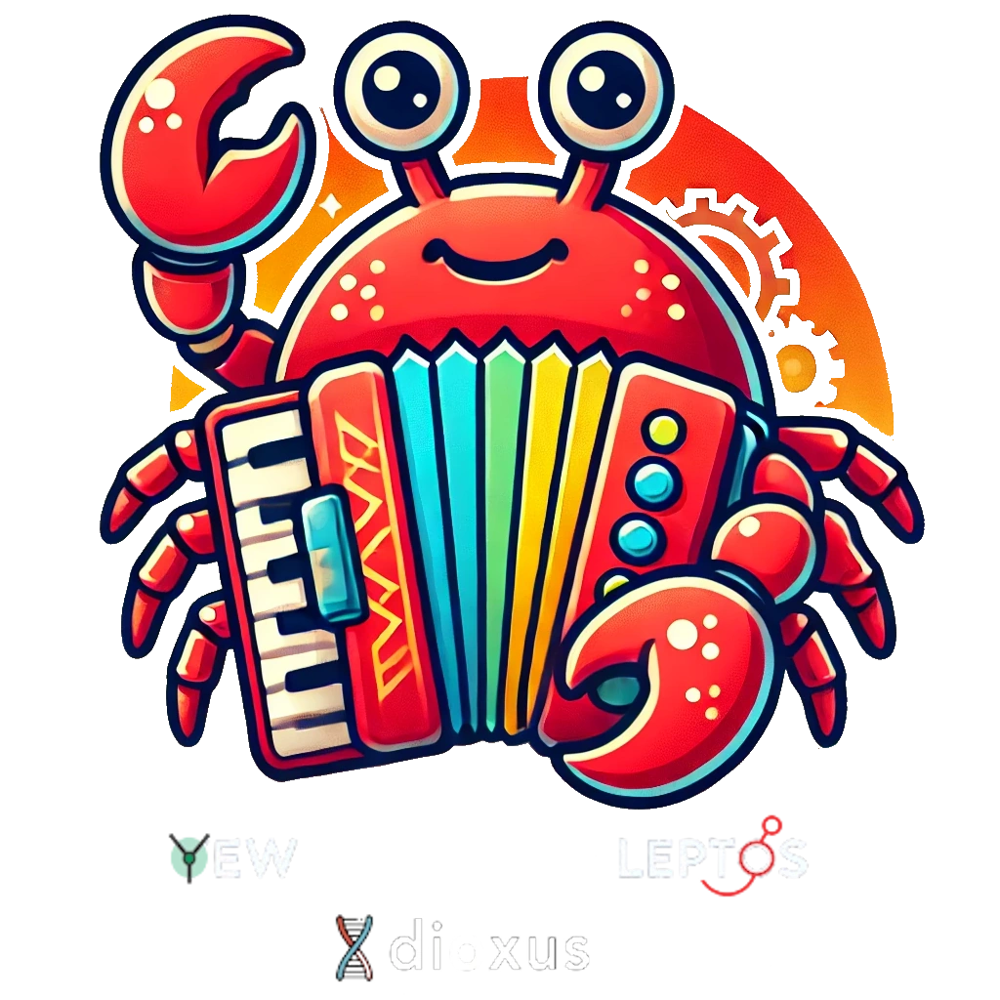

# 🪶 Accordion RS

## 🎬 Demo

| Framework | Live Demo |
| --- | --- |
| Yew |  |
| Dioxus |  |
| Leptos | TODO |

## 📜 Intro

Accordion RS is a highly customizable accordion component designed for Wasm-based frameworks like **Yew**, **Dioxus**, and **Leptos**. Easily create interactive, collapsible sections with rich behaviors, smooth transitions, and complete styling control.

## 🤔 Why Use Accordion-RS?

The following are some reasons why Accordion RS is a fantastic addition to your Wasm-based projects:

1. **🎨 Customizable Content**: Define separate content for expanded and collapsed states.
1. **⚡ Smooth Animations**: Control the transition speed and style of the opening and closing actions.
1. **🔄 Callbacks**: Attach callbacks to detect when the accordion opens or closes, giving you full control of state transitions.
1. **🧑‍💻 Easy Integration**: Works seamlessly with modern Wasm frameworks like Yew, Dioxus, and Leptos.
1. **🧩 Accessibility**: Optionally include ARIA attributes to make your accordion accessible to screen readers.

## Yew Usage

Refer to [our guide](YEW.md) to integrate this component into your Yew app.

## 🧬 Dioxus Usage

Refer to [our guide](DIOXUS.md) to integrate this component into your Dioxus app.

## 🌱 Leptos Usage (TODO)

Refer to [our guide](LEPTOS.md) to integrate this component into your Leptos app.

## 🤝 Contributions

Contributions are welcome! Whether it's bug fixes, feature requests, or examples, we would love your help to make Accordion RS better.

1. Fork the repository.
1. Create a new branch for your feature/bugfix.
1. Submit a pull request for review.

## 📜 License

Accordion RS is licensed under the [MIT License](LICENSE). You are free to use, modify, and distribute this library in your projects.
